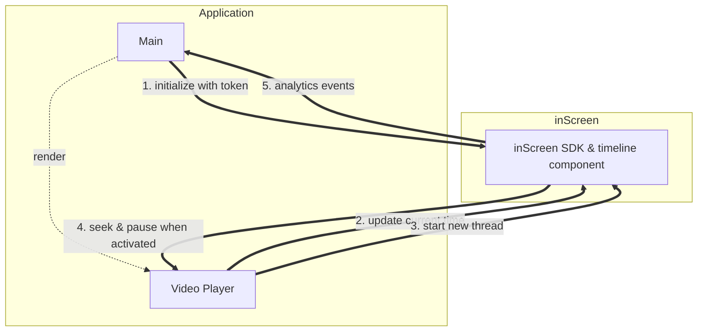
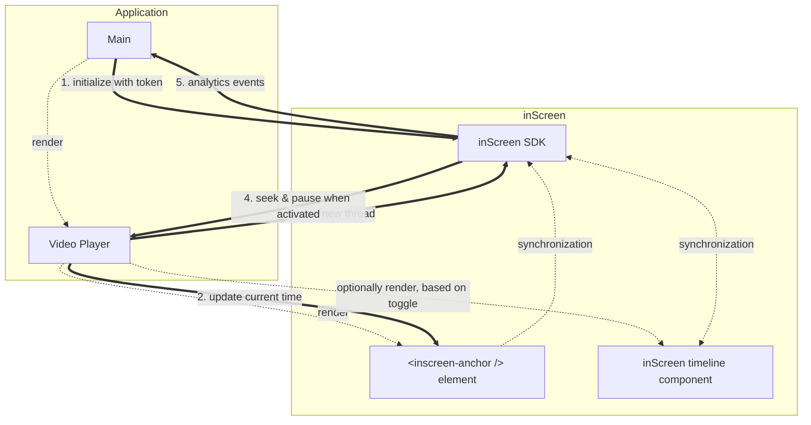

# inScreen example with video

[Read more at inScreen docs](https://docs.inscreen.com/)

To run the example:

1. Create a sandbox account.
2. Create an `.env` file in this folder as follows using the values of your sandbox account.
    ```
    REACT_APP_INSCREEN_TENANT_ID=...
    REACT_APP_INSCREEN_API_KEY=...
    ```
3. Run `npm start`

### Simplified Diagram



### Extended Diagram

